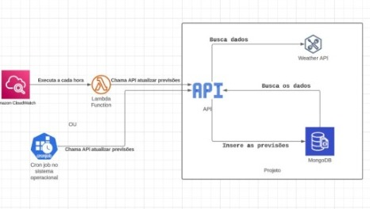
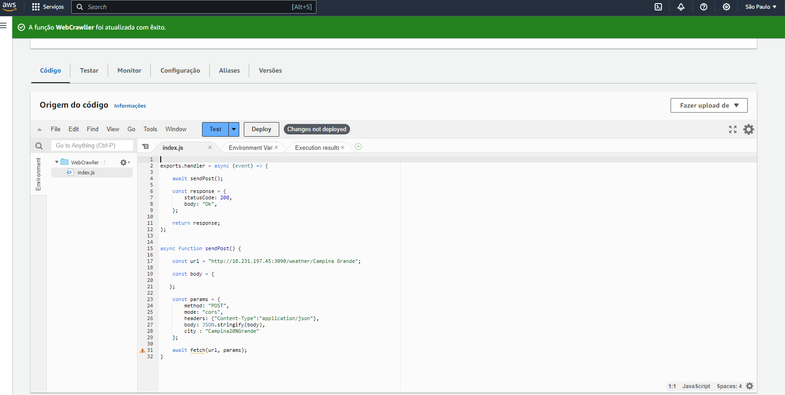
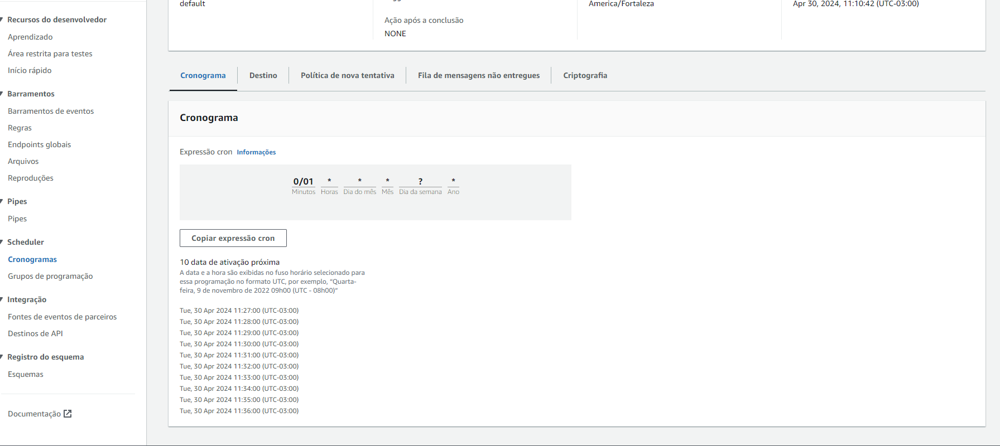

# Weather API Crawller

This is an API project developed by Lucas Cunha to provide weather data for a specific city. The API checks if the data is already in the database. If it is, it returns the data from the database; otherwise, it makes a request to the Weather API, stores the data in MongoDB Atlas, and returns it to the user. And also, this application was placed in Amazon AWS, and with the lambda function together with cloudwatch, it runs every 1 hour (stores data from a specific city )



## Installation

To use this API, you need to clone the repository to your local environment:

```bash
git clone https://github.com/Lucas-Cunhaa/Web-Crawler-project-.git
After cloning the repository, navigate to the project directory:


cd Web-Crawler-project-
Install the dependencies using npm:


npm install
```
## Requirements

Make sure you have Node.js installed on your machine. Additionally, you'll need to set up an instance of MongoDB Atlas and obtain the connection credentials.

## Configuration

After configuring the environment variables, you can start the API by running the following command:

```bash
node app.js
```
The API will be available at http://18.231.197.45:3090/weather?city={}.
 You can make requests to this URL to get weather data for a specific city.

## Routes

GET /weather?city=<city_name>: Returns weather data for the specified city. If the data is not available in the database, it will be fetched from the Weather API and stored in the database before being returned.

POST /weather/:city: Inserts the latest weather data for the specified city into the database and returns it.

GET /weather/:filter?city=<city_name>&startDate=<start_date>&endDate=<end_date>: Returns weather data for the specified city within the specified date range.

## Controllers

getWeather: Handles the GET /weather route to return weather data for the specified city.

insertWeather: Handles the POST /weather/:city route to insert and return the latest weather data for the specified city.

getWeatherByDate: Handles the GET /weather/:filter route to return weather data for the city within the specified date range.

## AWS 
I did the depoloy of this aplication in **Amazon WEB Service**, with an EC2 instance and with that i opening the pem key file in the terminal, i was able to access the virtual machine (linux) and installed node (to run my application) and git (to install my application on the machine).Therefore i created a **lambda function.** to get the most recent city forecast data, this function **fetches my insertWeather API**



## AWS cloudwatch
I made a trigger with **cloudwatch** and **event bridge**, so that every 15 minutes, it was made with a **cron function**, the lambda function is triggered and takes the weather data from a chosen city and updates it in my mongODB collection with the aim of always having the forecast for a specific city updated in the data base.




This project is licensed under the [MIT License](LICENSE).


